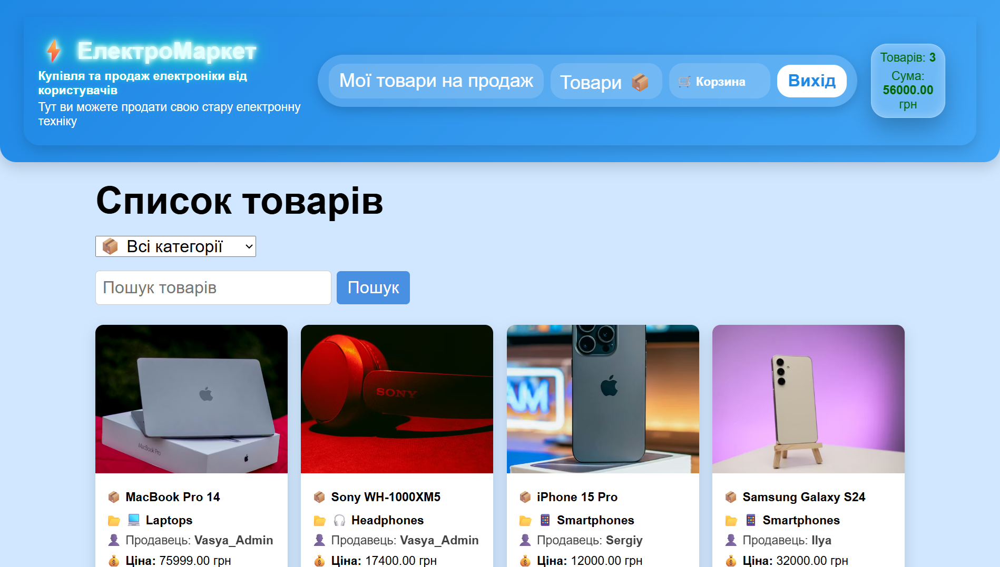
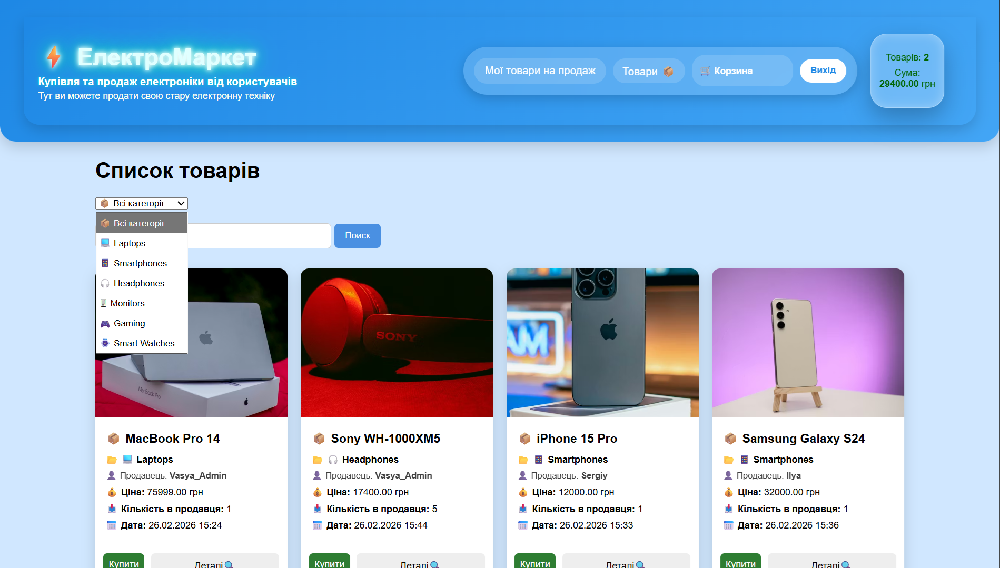
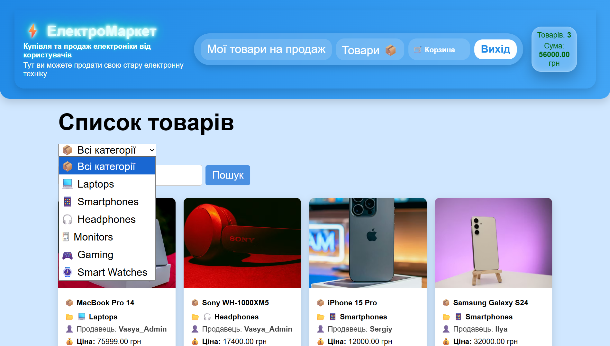
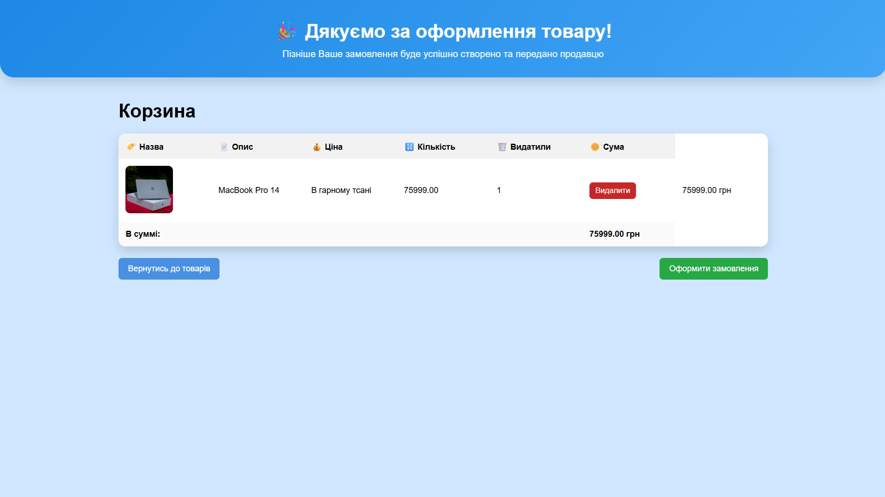
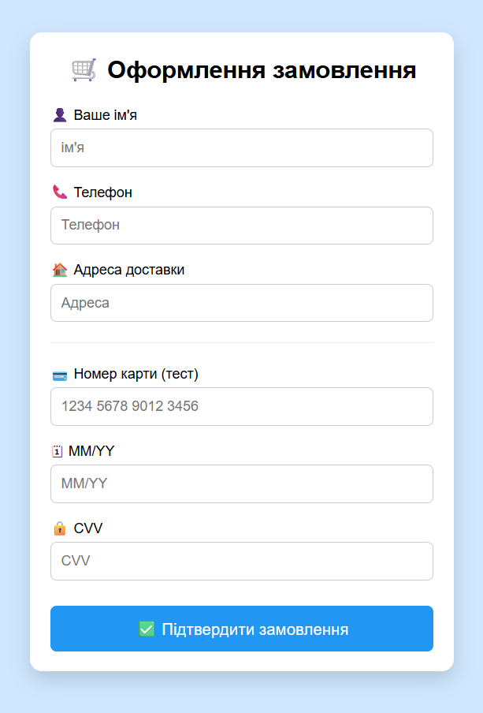
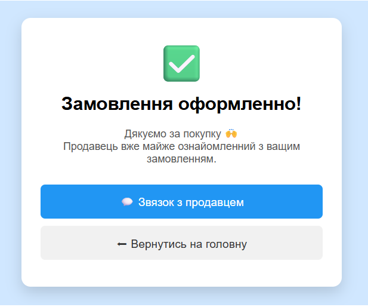
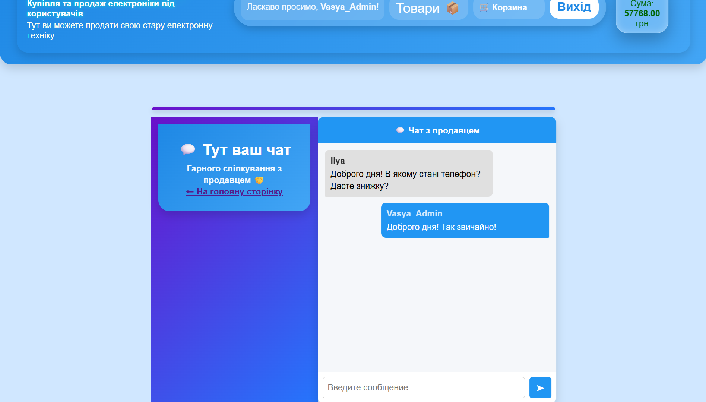
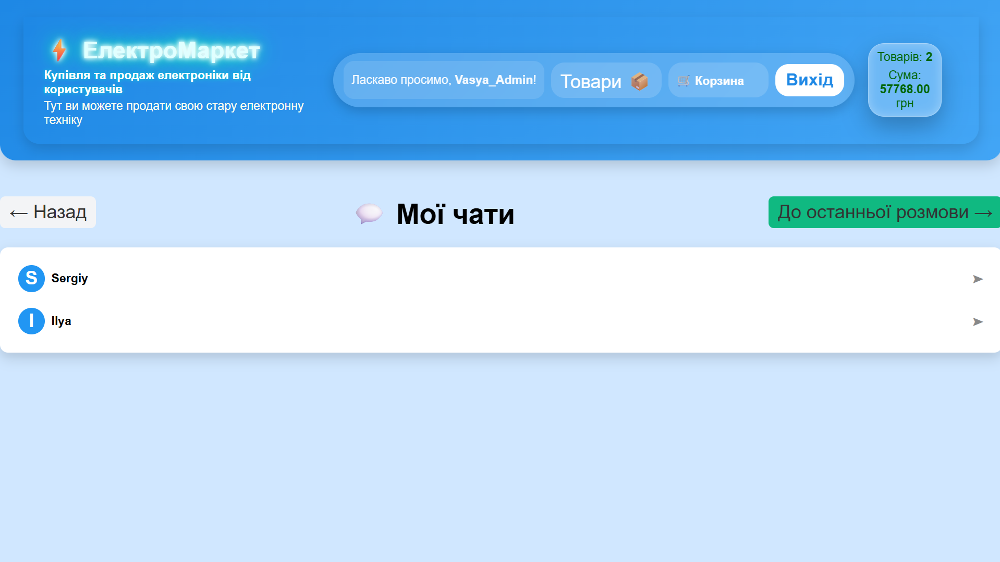
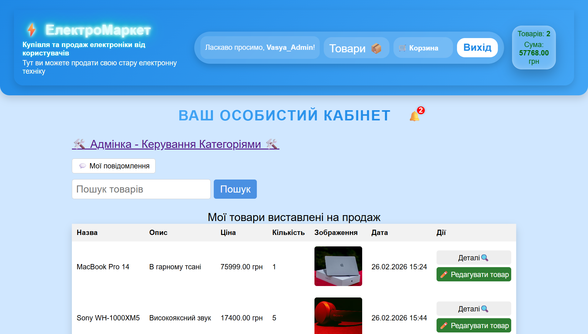
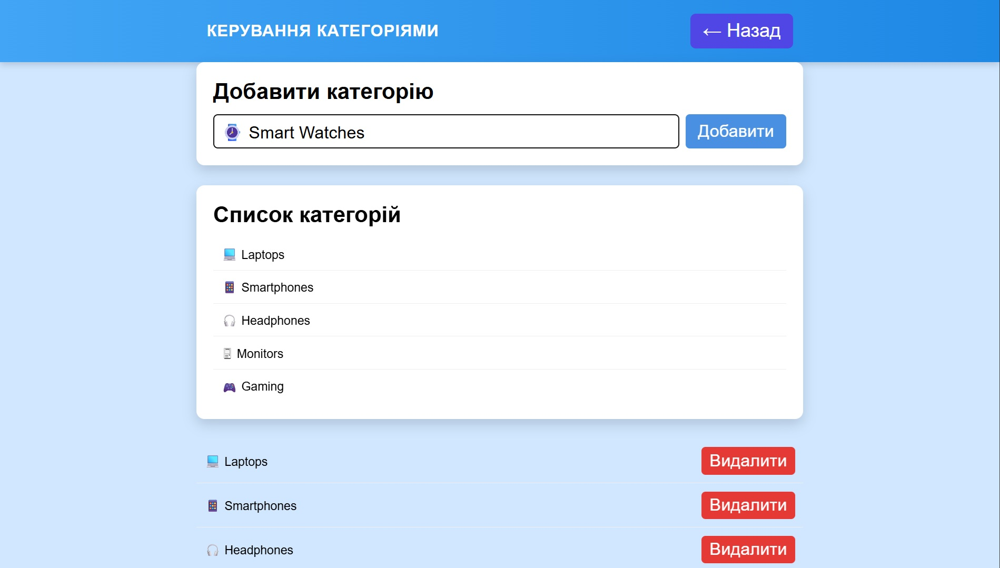

---

Online Electronics Store

📌 Опис проєкту

Online Electronics Store — це повнофункціональний backend-застосунок, розроблений на базі Spring Boot.

Система реалізує функціональність маркетплейсу, де користувачі можуть:

реєструватися та авторизуватися

додавати власні товари

переглядати товари інших продавців

додавати товари до кошика

оформлювати замовлення

спілкуватися з продавцем через чат

адміністратор може керувати категоріями товарів

Проєкт побудований із використанням чистої багатошарової архітектури та production-підходів до безпеки.

---

🖼 Інтерфейс застосунку

🛍 Сторінка товарів (доступна без авторизації)

Незалогінені користувачі можуть переглядати всі товари, додані продавцями.
Для покупки необхідно авторизуватися.

---

🔎 Пошук товарів

Пошук за назвою або категорією

Пошук за категорією

---

🧺 Кошик

Сторінка містить усі товари, які користувач додав до кошика.
Доступна лише для авторизованих користувачів.

---

📦 Оформлення замовлення

Покупець вводить свої дані:

ім’я

прізвище

номер телефону

номер картки

---

✅ Успішне оформлення

Після підтвердження замовлення користувач бачить сторінку успішного оформлення.

---

💬 Чат із продавцем

Після створення замовлення покупець може спілкуватися з продавцем щодо конкретного замовлення.

---

📩 Мої чати

Сторінка відображає всі активні чати користувача.
Є можливість швидко перейти до останнього активного чату.

---

🛠 Адмін-панель

Сторінка адміністратора

Кнопка керування категоріями відображається лише для користувачів із роллю ADMIN.

---

Керування категоріями

Адміністратор може:

додавати нові категорії

видаляти існуючі

---

Архітектура

Застосунок реалізований за принципом Layered Architecture (багатошарова архітектура):

Controller Layer
Service Layer
Repository Layer
Domain Model

Додатково:

DTO-шар ізолює API-контракти

Mapper-шар відповідає за перетворення Entity ↔ DTO

Security-шар реалізує аутентифікацію та авторизацію

Глобальний обробник помилок забезпечує єдину структуру відповіді

---

Структура пакетів

config → Конфігурація Spring
controller → REST та MVC контролери
dto → Data Transfer Objects
exception → Глобальні та кастомні винятки
mapper → Перетворення DTO ↔ Entity
model → JPA-сутності та enum
repository → Spring Data репозиторії
security → JWT та компоненти безпеки
service → Бізнес-логіка

---

Доменна модель

Основні сутності:

User

Product

ProductCategory

Cart

CartItem

CustomerOrder

OrderItem

Chat

Message

---

Ключові інженерні рішення

1. Розділення Cart і Order

Cart — поточний стан кошика користувача

CustomerOrder — знімок даних у момент оформлення

Це гарантує історичну коректність замовлень навіть при зміні ціни товару.

---

2. Snapshot-стратегія

У CustomerOrder зберігаються:

ім’я клієнта

телефон

адреса

priceAtOrder (у OrderItem)

Історія замовлення залишається незмінною.

---

3. Чат прив’язаний до замовлення

Chat ↔ CustomerOrder

Кожен чат стосується конкретного замовлення.

---

4. Lazy Loading

Використовується FetchType.LAZY, що покращує продуктивність.

---

5. orphanRemoval

При видаленні товару з кошика відповідний CartItem автоматично видаляється з БД.

---

6. Використання Enum

Role (USER / ADMIN)

OrderStatus

Gender

Підвищує типобезпечність.

---

7. Динамічний розрахунок суми

Сума кошика обчислюється динамічно через @Transient getTotal().

---

Архітектура безпеки

REST API — JWT (Stateless)

JWT аутентифікація

SessionCreationPolicy.STATELESS

BCrypt

Role-based доступ

Шлях: /api/**

---

Web-рівень — Session-based

Form login

CSRF-захист

Обмеження доступу для ADMIN

---

Тестування

Протестовані сервісні класи

Протестований один REST-контролер

Бізнес-логіка ізольована

---

Деплой

Docker

PostgreSQL

Незалежність від локального середовища

---

🚀 Запуск проєкту (Docker)

Вимоги

Docker

Docker Compose

---

1. Клонування

git clone https://github.com/your-username/online-electronics-store.git
cd online-electronics-store

---

2. Запуск

docker compose up --build

Backend буде доступний за адресою:

http://localhost:8080

---

3. Зупинка

docker compose down

Очистити БД:

docker compose down -v

---
